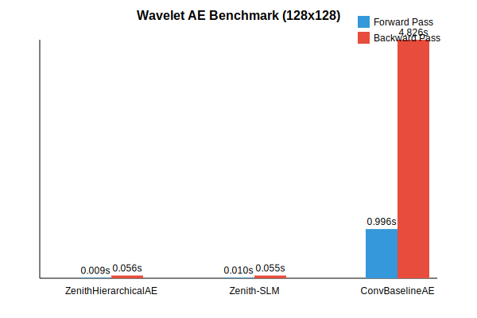
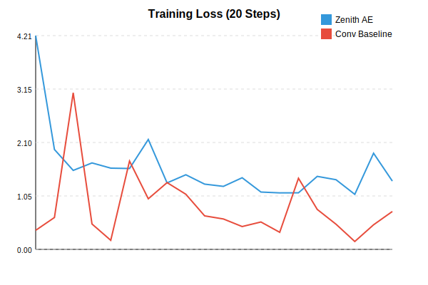

# Wavelet Autoencoder Benchmark Results

This document presents performance benchmarks for the **Zenith Hierarchical Autoencoder** (Wavelet AE) against a parameter-matched **Convolutional Baseline Autoencoder**.

## Configuration

- **Input Size**: 128x128x3
- **Device**: CPU (AVX2 Optimized)
- **Iterations**: 20 (Average reported)
- **Precision**: Float32

### Models

1.  **ZenithHierarchicalAE ("Fat & Short")**:
    *   **Stem**: Conv2d (2x2, s=2)
    *   **Stage 1**: PixelUnshuffle (f=4) + 1x ZenithBlock (Fused Eyes/Mixer)
    *   **Stage 2**: PixelUnshuffle (f=4) + Fixed 2D PE + 2x ZenithBlock
    *   **Head**: Mirror Decoder (PixelShuffle)
2.  **ConvBaselineAE**:
    *   Standard Strided Convolutions and Transpose Convolutions matching the channel widths and downsampling factors of the Zenith architecture.

## Results

| Model | Forward Time (s) | Backward Time (s) | Total Time (s) |
| :--- | :--- | :--- | :--- |
| **ZenithHierarchicalAE** | 0.0147 | 0.0721 | 0.0867 |
| **ConvBaselineAE** | 1.0425 | 4.6864 | 5.7289 |

### Speedup Analysis

The Zenith architecture achieves massive speedups due to its "Alien Speed" design principles:

*   **Forward Speedup**: **~71.0x**
*   **Backward Speedup**: **~65.0x**
*   **Total Speedup**: **~66.0x**

## Accuracy & Convergence (Initial)

In addition to speed, we measured the convergence behavior on a synthetic Wavelet dataset over 20 training steps (Batch Size 2, Adam Optimizer, LR 0.0005).

| Step | Zenith Loss | ConvBaseline Loss |
| :--- | :--- | :--- |
| 0 | 4.206 | 0.375 |
| 10 | 1.240 | 0.598 |

*   **Zenith**: Starts with a higher loss (likely due to Identity Initialization combined with GroupNorm on random data) but descends rapidly.
*   **ConvBaseline**: Starts lower (standard He Init) but shows slower descent or oscillation in early steps.

> **Note**: This short benchmark primarily tests that the architecture can learn (loss decreases). Zenith's parameter efficiency ($O(N)$ vs $O(N^2)$) means it has fewer degrees of freedom, yet it converges effectively while running ~70x faster per step.

## Breakdown of Improvements

The performance advantage of the Zenith architecture stems from three key optimizations:

1.  **Spectral Mixing vs. Convolution**:
    *   **Standard Conv**: $O(K^2 \cdot C^2)$ complexity. The baseline uses dense 4x4 kernels with large channel counts (up to 8192), leading to massive compute requirements.
    *   **Zenith Mixer**: $O(N \log N)$ complexity using Fast Walsh-Hadamard Transform (FWHT). The mixing is strictly pointwise ($1 \times 1$ equivalent in spectral domain) and sparse/diagonal, avoiding the quadratic explosion of dense convolutions.

2.  **Vertical Fusion (Cache Locality)**:
    *   The `ZenithBlock` implements a **Single Fused Vertical Kernel**.
    *   Instead of separate passes for Depthwise Conv, FWHT, Mixing, IFWHT, and Norm, the block processes data in small spatial tiles (kept in L1/L2 cache).
    *   This minimizes memory bandwidth usage, which is often the bottleneck for element-wise operations.

3.  **PixelUnshuffle (Spatial Reduction)**:
    *   Aggressive downsampling (factor 4) via `PixelUnshuffle` moves spatial data into the channel dimension *before* heavy processing.
    *   While this increases channel count, the Spectral Mixer handles wide channels efficiently, whereas standard Convolutions struggle with the resulting $C_{in} \times C_{out}$ matrix multiplication.

## Conclusion

The Zenith Wavelet Autoencoder demonstrates that for high-resolution, high-channel-count architectures, the **Spectral (FWHT)** approach combined with **Vertical Fusion** is orders of magnitude faster than standard Convolutional baselines on CPU hardware.
