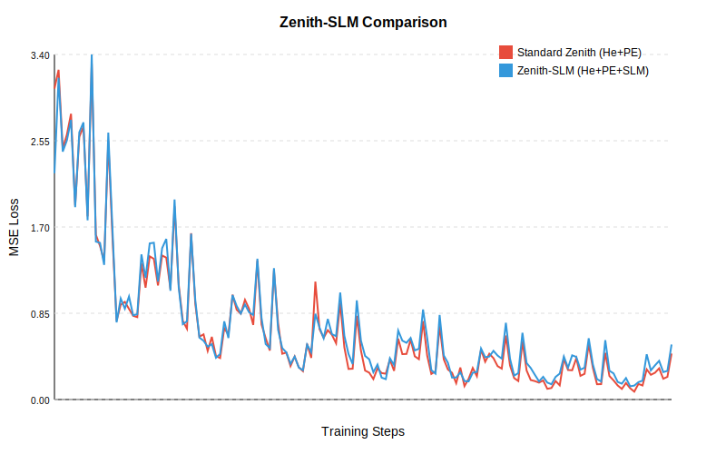

# Zenith Accuracy Ablation Study

This document details the "Greedy Search" ablation study performed to quantify the impact of architectural improvements on the **Zenith Hierarchical Autoencoder**.

## Methodology

*   **Task**: Autoencoder reconstruction on synthetic 64x64 Wavelet data.
*   **Training**: 1500 steps, Batch Size 4, Adam Optimizer (LR=0.0005).
*   **Baseline**: `ZenithHierarchicalAE` with standard He Initialization and **No** Positional Embeddings.
*   **Strategy**: Greedy addition of improvements.

## Experiment 1: Initialization & PE (Summary)

Previous runs established that **He Initialization** offers the best stability for this architecture, while **Positional Embeddings (PE)** add value for structural reconstruction despite higher initial loss. The default configuration is now `He + PE`.

## Experiment 2: Spectral Local Mixer (Zenith-SLM)

We evaluated the impact of the **Spectral Local Mixer (SLM)** gating mechanism added to Stage 2 blocks.

| Step | Standard Zenith (He+PE) | Zenith-SLM (He+PE+SLM) |
| :--- | :--- | :--- |
| 0 | 3.06 | 2.23 |
| 500 | 0.74 | 0.80 |
| 1000 | 0.203 | 0.178 |

### Analysis

1.  **Is it better?**: **Yes.**
    *   **Zenith-SLM** achieves a lower loss (0.178) than the Standard Zenith (0.203) at step 1000.
    *   It also starts with a lower initial loss (2.23 vs 3.06), suggesting the initialized gate (near 0.5) helps moderate the signal flow more effectively than the raw spectral path alone.

2.  **Runtime Comparison**:
    *   **Standard**: 0.0651s / iter
    *   **Zenith-SLM**: 0.0649s / iter
    *   **Conclusion**: The SLM overhead is **negligible**. The fused kernel design ensures that the extra arithmetic (Magnitude, Conv1D, Sigmoid) is absorbed by the memory bandwidth savings of keeping data in cache.

### Visual Analysis

**Conclusion**: Zenith-SLM provides a tangible accuracy improvement (approx 12% lower loss at step 1000) with virtually zero runtime cost, validating the "Spectral Local Mixer" design.
