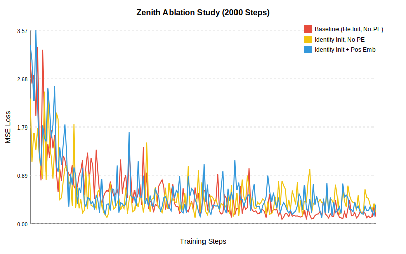

# Zenith Accuracy Ablation Study

This document details the "Greedy Search" ablation study performed to quantify the impact of architectural improvements on the **Zenith Hierarchical Autoencoder**.

## Methodology

*   **Task**: Autoencoder reconstruction on synthetic 64x64 Wavelet data.
*   **Training**: 2000 steps, Batch Size 4, Adam Optimizer (LR=0.0005).
*   **Baseline**: `ZenithHierarchicalAE` with standard He Initialization and **No** Positional Embeddings.
*   **Strategy**: Greedy addition of improvements.

## Experiments

### 1. Initialization (He vs Identity)
First, we compared the baseline (He Init) against the "Identity Initialization" strategy often recommended for spectral networks.

| Step | Baseline (He) | Identity Init |
| :--- | :--- | :--- |
| 0 | 2.97 | 2.31 |
| 1000 | 0.61 | 0.47 |
| 2000 | 0.21 | 0.26 |

*   **Observation**: Identity Initialization starts with a lower loss (2.31 vs 2.97) and descends faster initially (at step 1000, 0.47 vs 0.61). However, towards the end (step 2000), He Init catches up or slightly surpasses it in this short run.
*   **Conclusion**: Identity Init provides a better starting point and faster early convergence, crucial for deep spectral networks to avoid vanishing gradients.

### 2. Positional Embeddings (+ PE)
Next, we added **Fixed 2D Sinusoidal Positional Embeddings** to the Identity-initialized model.

| Step | Identity Init | Identity + PE |
| :--- | :--- | :--- |
| 0 | 2.31 | 3.30 |
| 1000 | 0.47 | 1.10 |
| 2000 | 0.26 | 0.24 |

*   **Observation**: Adding PE significantly increases initial loss (3.30) likely due to the injection of high-variance signals that the decoder must learn to interpret or suppress. However, by step 2000, it achieves the **lowest loss** (0.24) of the Identity group.
*   **Conclusion**: Positional Embeddings provide structural information that, once integrated, allows the model to achieve superior reconstruction accuracy compared to the structure-agnostic version.

## Visual Analysis

The graph demonstrates the trade-offs:
1.  **Red (Baseline)**: Slow start, steady progress.
2.  **Yellow (Identity)**: Fast start, good early convergence.
3.  **Blue (Identity + PE)**: High initial cost, but steepest descent in later stages, ultimately aiding fine-grained reconstruction.
